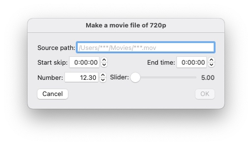

# queryByGUI

This is a command line tool running on macOS 11.0 - 12.4
to receive the user's response
through a window displayed on the desktop that contains simple GUI elements.
This software was developed under expectation to be useful
for shell scripting, typically working with ShortCut utility.

You can specify the GUI elements and the arrangement in the window
by feeding a text in JSON format from the standard input.

When the user click one of the [push buttons](#pushButton) in the window,
the process of queryByGUI stops after it outputs a text to the standard output that
expresses a list of name-value pairs.

Created in June 4, 2022. Modified in June 5, 2022.

By [Tatsuo Unemi](http://www.intlab.soka.ac.jp/~unemi/),
Department of Information Systems Science,
[Soka University](https://www.soka.ac.jp/en/).

Table of Contents
--
[toc]

## How to install
`queryByGUI` is an executable file in the form of universal binary for both
Intel x86\_64 and Apple arm64 architectures to be launched from shell command line.
You can find the file under `bin` directory of this repository.
Copy or move the file into an appropriate directory in the local storage
of your machine, such as `/usr/local/bin`, if you want to make it
easier to invoke it just by typing-in `queryByGUI` in your `Terminal`.

If you want to modify the source code for your own usage,
make a clone of this repository into a local directory of your computer,
and then open the project package `queryByGUI.xcodeproj` using `Xcode`.
After your edit and test, the following command is effective
to install the executable file into `/usr/local/bin` directory.
Note that *Xcode command line tools* must be installed in your computer
before issuing `xcodebuild` command.

	cd .../queryByGUI	# go to the top directory of the copy of this repository.
	xcodebuild -target queryByGUI archive
	mv -f /tmp/queryByGUI.dst/usr/local/bin/queryByGUI /usr/local/bin/
	rm -rf /tmp/queryByGUI.dst build	# if you want to clean up the working files.

## Command options
`queryByGUI` command can be followed by optional arguments separated by white spaces.
The possible options are as follows.

- `--version` shows a text string of version information, then quits immediately.
- `-F <sep>` makes `<sep>` as the separator between name and value for the result
[output](#output).
- `-R <sep>` makes `<sep>` as the separator between pairs for the result
[output](#output).

The separator must be a string shorter than eight ASCII characters.
You can include control characters by escape sequence with backslash character (`\`),
such as `\a`, `\b`, `\f`, `\n`, `\r`, and `\t` for bell, backspace, form feed, new line,
and carriage return respectively. An arbitrary seven bits code is allowed by an octal
representation of three digits after a backslash, for example, `\033` is the escape code.
Note that backslash character must be escaped in shell script using double backslash
or single quotation marks.

## Specification of GUI arrangement

### Top level object
The top level data of JSON form is an *object* where the possible string-value pairs are:

|string|value type|value|default value|
|-----|-----|-----|-----|
|`"title"`|string|title string of the window|null string|
|`"width"`|number|width of the window|400|
|`"height"`|number|height of the window excluding the title bar|200|
|`"elements"`|array|list of GUI elements|N/A|

If it lacks the list of GUI elements or the list is empty,
queryByGUI shows an error message and quit immediately with an error code.

ex.

	{"title":"Please input your choice","width":200,"height":120,
	 "elements":[ ... ]}

### GUI elements

Each GUI element is represented in a form of *object* including a number of
attributes depending on the type of element.
Each object must have the `"type"` to specify the type of the element.
Each object may have a `"name"` to be referred from objects for the other elements
to specify the relative position in the window.
The names are also used in the final output if the element has a value.
If an element has not a name but a title, then the title is used instead of the name.
If neither name nor title exist, the class name, such as `NSTextField` for
text element, is used. 
  
The possible types are: label, text, digits, date, time,
checkbox, popup button, radio buttons, slider, and push button so far.

#### label
|string|value type|value|
|-----|-----|-----|
|`"type"`|string|`"label"`|
|`"text"`|string|the content to be shown|

Label element has no value.

ex. `{"type":"label","text":"Specify the name of fruit."}`

#### text
|string|value type|value|default value|
|-----|-----|-----|-----|
|`"type"`|string|`"text"`|N/A|
|`"text"`|string|the initial value|null string|
|`"placeholder"`|string|shown as a template|null string|
|`"mandatory"`|boolean|indicates mandatory[*1](#mandarotyText)|false|
|`"title"`|string|the title string shown at the left-side|null string|

*1. `OK` button becomes enabled only when
all of the mandatory **text**s have text value.

#### digits
|string|value type|value|default value|
|-----|-----|-----|-----|
|`"type"`|string|`"digits"`|N/A|
|`"value"`|number|the initial value|0|
|`"min"`|number|the minimum value|-10000|
|`"max"`|number|the maximum value|10000|
|`"integer"`|number|the number of columns in the integer part|4|
|`"fraction"`|number|the number of columns in the fraction part|2|
|`"title"`|string|the title string shown at the left-side|null string|
|`"stepper"`|boolean|indicates if a stepper follows it|false|
|`"increment"`|number|increment/decrement value of stepper|1|

#### date
|string|value type|value|default value|
|-----|-----|-----|-----|
|`"type"`|string|`"date"`|N/A|
|`"value"`|string|the initial value[*2](#dateForm)|`"today"`|
|`"min"`|string|the earliest date allowed[*2](#dateForm)|no limit|
|`"max"`|string|the latest date allowed[*2](#dateForm)|no limit|
|`"title"`|string|the title string shown at the left-side|null string|

*2. `"today"` or a string representing a date,
a sequence of four digits of year, two digits of month, and two digits of day,
separated by `-`. 
For example, `"2022-06-04"` means June 4th in the year 2022.

#### time
|string|value type|value|default value|
|-----|-----|-----|-----|
|`"type"`|string|`"time"`|N/A|
|`"value"`|string|the initial value[*3](#timeForm)|`"now"`|
|`"min"`|string|the earliest time allowed[*3](#timeForm)|`"00:00:00"`|
|`"max"`|string|the latest time allowed[*3](#timeForm)|`"23:59:59"`|
|`"title"`|string|the title string shown at the left-side|null string|

*3. `"now"` or a string representing a time,
a sequence of two digits of hour from 00 to 23,
two digits of minute from 00 to 59, and two digits of second from 00 to 59,
separated by `:`. 
For example, `"18:23:03"` means 6:23:3 PM.

#### checkbox
|string|value type|value|default value|
|-----|-----|-----|-----|
|`"type"`|string|`"checkbox"`|N/A|
|`"value"`|string|the initial value, `"on"`, `"off"`, or `"mixed"`|`"off"`|
|`"allow mixed"`|boolean|indicates if the `"mixed"` state is allowed.|false|

#### popup button
|string|value type|value|default value|
|-----|-----|-----|-----|
|`"type"`|string|`"popup button"`|N/A|
|`"choice"`|array of strings|names of choice[*4](#choice)|N/A|
|`"title"`|string|the title string shown at the left-side|null string|

*4. Names shown as alternatives.
A name start with `"*"` becomes the default choice.
If no name has `"*"`, the first element in the name list becomes the default.

#### radio buttons
|string|value type|value|default value|
|-----|-----|-----|-----|
|`"type"`|string|`"radio buttons"`|N/A|
|`"choice"`|array of strings|names of choice[*4](#choice)|N/A|
|`"columns"`|number|the number of columns|1|

#### slider
|string|value type|value|default value|
|-----|-----|-----|-----|
|`"type"`|string|`"slider"`|N/A|
|`"value"`|number|the initial value|0|
|`"min"`|number|the minimum value|0|
|`"max"`|number|the maximum value|1|
|`"digits"`|boolean|indicates if a digits follows it|false|
|`"integer"`|number|format parameter for [digits](#digits)|4|
|`"fraction"`|number|format parameter for [digits](#digits)|2|
|`"editable"`|boolean|indicates if the digits is editable|true|
|`"title"`|string|the title string shown at the left-side|null string|

#### push button
|string|value type|value|default value|
|-----|-----|-----|-----|
|`"type"`|string|`"push button"`|N/A|
|`"title"`|string|the title string[*5](#buttonTitle)|null string|

If no push button is included in the list of GUI elements,
one `"OK"` button is automatically created and placed at the bottom right corner
in the window.

*5. If the title is `"Cancel"`,
short cut key is set to Escape code.
If the title is `"OK"`, short cut key is set to Newline code.

### Attributes for arrangement
The default position and size of each element are (20,20)
and a natural size depending on the type and the content.
queryByGUI does not make any care on overlapped elements.
To indicate the position and size of each element,
you can use the following attributes to specify which element
is neighboring with in both vertical and horizontal dimensions. 

|string|value type|value|default value|
|-----|-----|-----|-----|
|`"width"`|number/string|absolute width or another element's name|natural size|
|`"height"`|number/string|absolute height or another element's name|natural size|
|`"left"`|string|`"window"` or another element's name|`window`|
|`"right"`|string|`"window"` or another element's name|none|
|`"lower"`|string|`"window"` or another element's name|`window`|
|`"upper"`|string|`"window"` or another element's name|none|
|`"baseline"`|string|a name of another element|none|
|`"align left"`|string|another element's name|none|
|`"align right"`|string|another element's name|none|

If you specify both `left` and `right` but not `width`,
queryByGUI assumes the width is flexible to set the positions of
left and right edges of the element as specified.
The case of `upper`, `lower`, and `height` is the same.
`"baseline"` is useful to align two elements
as the vertical position of text baselines of them are same.

When there is no element of specified name, queryByGUI outputs
an error message and quits immediately.
When the specification is redundant, queryByGUI uses items
in unknown order, then some items are ignored.

When the value for `width` is a name of another element,
the width of *core object* in the element is adjusted to the same
dimension with the core object of the referred element.
`height`, `align left`, and `align right` also work in the same ways. 
Core object is the main part of element, for example,
the title is ignored in the cases of
text, digits, date, time, popup button, and slider.
Stepper for digits and digits for slider are also ignored.

## Output text
The output text from queryByGUI is a sequence of name-value pairs.
The last pair in the sequence indicates which push button was clicked,
for example, `Clicked:OK` when `OK` button was clicked.
In default, the separator between name and value is colon (`:`),
and the separator between pairs is newline (`\n`).
You can change these separators by [command options](#commandOptions).

## Example

When you run a shell script

	#! /bin/bash
	# queryByGUI sample code
	#
	queryByGUI << EOF > /tmp/qBG_$$
	{"title":"Make a movie file of 720p","height":156,
	"elements":[
	  {"type":"text","placeholder":"/Users/***/Movies/***.mov",
		"title":"Source path:","mandatory":true,
	    "upper":"window","left":"window","right":"window","name":"Path"},
	  {"type":"time","title":"Start skip:","value":"00:00:00",
	    "upper":"Path","name":"SS"},
	  {"type":"time","title":"End time:","value":"00:00:00",
	    "baseline":"SS","right":"window","name":"ET"},
	  {"type":"digits","title":"Number:","value":12.3,"stepper":true,
	    "upper":"ET","name":"Number"},
	  {"type":"slider","title":"Slider:","digits":true,"integer":2,"editable":false,
		"min":5,"max":10,
		"right":"window","left":"Number","baseline":"Number"},
	  {"type":"push button","title":"Cancel"}
	]}
	EOF

a window shown in Figure 1 is displayed.
When you click the OK button after you operate GUI elements
as shown in Figure 2, you will get a file at `/tmp/qBG_$$`
containing the output text as follows, where
`$$` is replaced with the process ID by bash.

	Path:~/Movies/myAmazingMovie.mov 
	SS:00:13:04
	ET:01:57:51
	Number:-41.74
	NSSlider:7.580569083230538
	Clicked:OK

||
|:--:|:--:|
|Figure 1.|Figure 2.|

You may continue the shell script code as follows, for example.

	# When Cancel button was clicked, remove output file and quit.
	if [ `fgrep -q Clicked:Cancel /tmp/qBG_$$; echo $?` -eq 0 ]
	then rm /tmp/qBG_$$; exit; fi
	srcPath=`awk -F: '/^Path:/{print $2}' /tmp/qBG_$$`
	ffmpeg -i $srcPath -s 1280x720\
	 -ss `awk -F: '/^SS:/{printf "%s:%s:%s",$2,$3,$4}' /tmp/qBG_$$`\
	 -to `awk -F: '/^ET:/{printf "%s:%s:%s",$2,$3,$4}' /tmp/qBG_$$`\
	 -y `echo $srcPath | awk -F/ '{OSF="/";$NF="new.mp4";print}'`
	rm /tmp/qBG_$$

This script is converting a movie file into 1280x720 mpeg4 format
named `new.mp4` under the same folder with the source movie file
using `ffmpeg` command.

Instead of typing in the full path by yourself,
you can drag the `Finder`'s file icon and
drop it into the text field in order to fill the field with the full path text. 

---
&copy; Tatsuo Unemi, 2022. all rights reserved.
